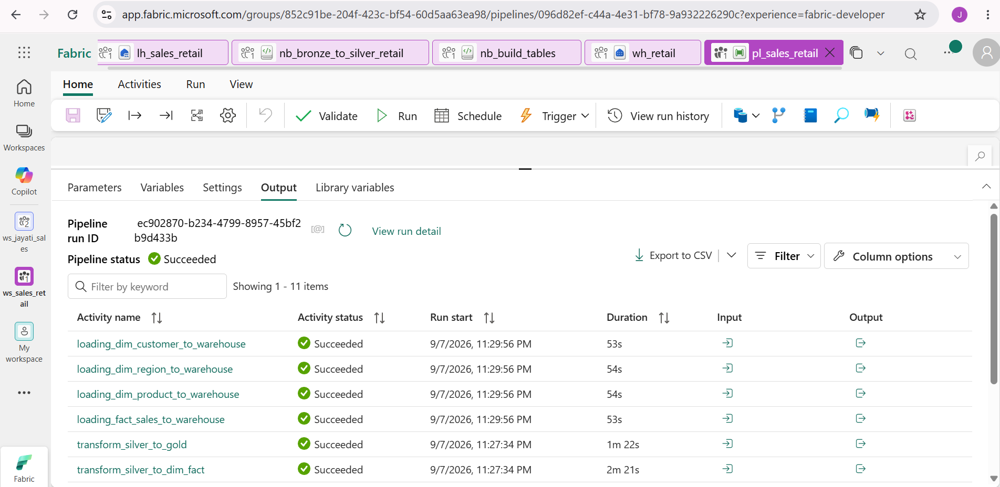
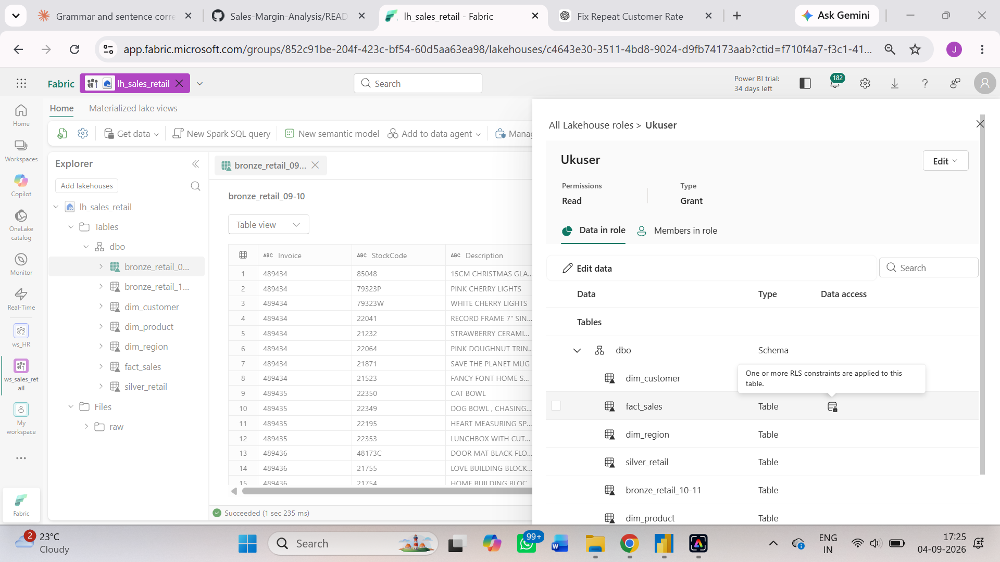
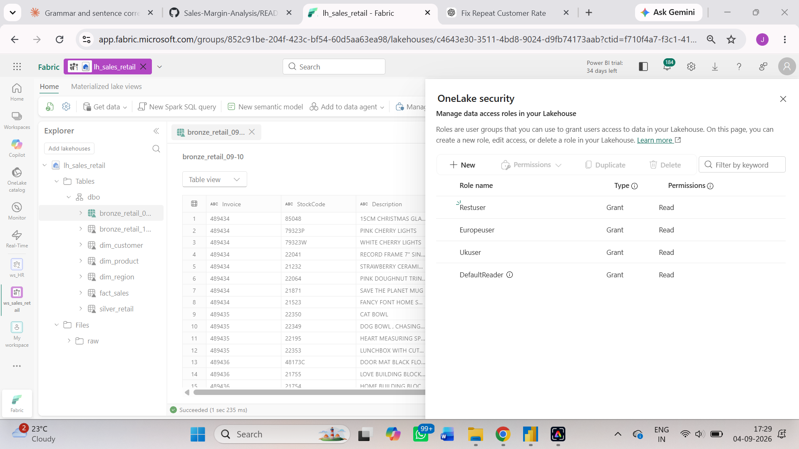
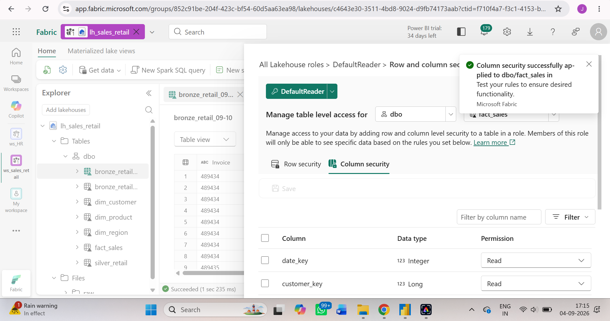

# Sales Retail Analysis

## 1. Project Title
**Sales Retail Analysis**

Built an end-to-end sales retail analysis solution in Microsoft Fabric, ingesting ~1M+ records through a Fabric pipeline to understand which customers, products, and regions are actually driving revenue.

## 2. Short Description
The Sales Retail Analysis is an analytical report designed to help Priya (Head of Sales Ops) answer a question that comes up in every weekly review: *"Which customers, products, and regions are actually driving our revenue — and which ones are quietly dying?"* This dashboard shows revenue trends, customer segments (who's valuable, who's at risk), regional performance, and product performance, all sliceable by date. This tool is intended for use by data analysts, the sales department, management, and data-driven strategists who want to understand revenue trends.

## 3. Tech Stack
The dashboard was built using the following tools and technologies:

- **Microsoft Fabric Pipeline** – Ingested ~1M+ records through an online dataset and applied transformations using a notebook.
- **Microsoft PySpark Notebook** – Data transformation, cleaning, feature engineering, and dimensional modeling (building dimension and fact tables) using PySpark.
- **Microsoft Lakehouse** – Primary data source with structured Delta tables in the Tables section.
- **Microsoft Fabric Warehouse** – Loaded dimension and fact tables, created a `Dim_Date` table, and analyzed the data using views before connecting it to the semantic model.
- **Microsoft Fabric Semantic Model** – Connected to the warehouse and built relationships, inheriting OneLake security automatically.
- **DAX (Data Analysis Expressions)** – Used for calculated measures, dynamic visuals, and conditional logic.
- **Power BI Desktop** – Main data visualization platform used for report creation.
- **OneLake Security** – Implemented column-level and row-level security to ensure the safety of sensitive data.
- **App** – Published `App_Retail` for end-user access.
- **File Format** – `.pbix` for development and `.png` for dashboard previews.

## 4. Data Source
- **Source:** UCI Machine Learning Repository — Online Retail II
- **Link:** [Sales Retail Dataset](https://archive.ics.uci.edu/dataset/502/online+retail+ii)

Data covers ~1M+ records, including details such as invoice date, invoice number, description, customer ID, stock code, price, country, and quantity, for the years 2009–2011.

## 5. Workflow
The end-to-end pipeline was built entirely within Microsoft Fabric:

- **Workspace** – Created `ws_sales_retail` to host all Fabric items for this project.
- **Notebook** – Created a PySpark notebook and built the pipeline following medallion architecture: **Bronze** (raw invoice data ingested, checked types/nulls/row counts), **Silver** (cleaned, correctly typed, deduplicated), and **Gold** (aggregated and enriched with region, net revenue, and customer-level summaries for reporting).
- **Lakehouse** – Loaded all three layers into `lh_sales_retail` as structured Delta tables, with Bronze, Silver, and Gold sitting inside the same lakehouse.
- **Notebook (Dimensional Modeling)** – Created a notebook to build dimension and fact tables from the silver layer, then loaded them into the Warehouse.
- **Warehouse** – Loaded the dimension and fact tables into `wh_retail`, created a `Dim_Date` table, and analyzed the data using views to validate the model before connecting it downstream.
- **Security** – Applied column-level security (hiding `price`) and row-level security (filtering by `region`) directly using OneLake security, so protection is enforced consistently across every engine that queries the data, not just the report.
- **Semantic Model** – Built `sales_retail_model`, connecting it to `wh_retail`, which automatically inherits the OneLake security rules with no separate configuration needed.
- **Report** – Created the Sales Retail Analysis report in Power BI, with separate pages for Overview and Performance.
- **App** – Published `App_Retail` for end-user access.

## 6. Feature Highlights

### Business Problem
I used AI as a client, roleplaying as Priya, Head of Sales Ops. Her sales team and leadership kept asking the same question in every weekly review: *"Which customers, products, and regions are actually driving our revenue — and which ones are quietly dying?"*

**Key Questions:**
- Are we retaining customers, or is flat revenue masking churn that's being covered up by new customer acquisition?
- Which countries/regions are growing vs. declining?
- Are a small number of wholesale/bulk customers propping up the numbers while the regular customer base shrinks?
- What's our repeat purchase rate, and which products drive repeat business vs. one-off purchases?
- Are we over-relying on a handful of SKUs, and what happens to revenue if one of them has a supply issue?

### Goal of the Dashboard
The goal of this dashboard was to create an interactive report that helped the Sales department understand which customers, products, and regions were actually driving revenue — and which were quietly declining. This dashboard helped Priya communicate to leadership and senior management what steps could be taken to manage revenue, reduce order risk, and support business growth.

### Data Quality & Cleaning Decisions
A few deliberate cleaning and modeling decisions shaped this dashboard, worth calling out since they materially affect the numbers above:

- **Cancellation flag:** `is_cancelled` is derived from the `Invoice` number (any invoice starting with "C" is a cancellation), not from `StockCode`. An earlier build mistakenly flagged based on StockCode starting with "C" (which only caught the `C2`/carriage code), silently under-counting real cancellations — this has been corrected and spot-checked against sample invoices.
- **Non-merchandise exclusion:** Operational line items (`POST`, `DOT`, `M`, `BANK CHARGES`, `ADJUST`, `AMAZONFEE`, `D`, `S`, `C2`, `CRUK`, `TEST001`, etc.) are flagged via `is_merchandise = False` and excluded from all product-level performance and cancellation-rate visuals, so shipping/fee line items don't appear as "top products."
- **Minimum order-count threshold:** The "High-Volume Products: Cancellation Risk" table (Overview page) applies a minimum order-volume filter (≥20 orders) before ranking, to prevent low-volume products from producing misleading, statistically unreliable cancellation rates. Concrete example: "Paper Craft, Little Birdie" had 2 total orders, 1 of them cancelled — a 50% cancellation rate that would have ranked it as one of the dashboard's riskiest products, purely on the strength of a single unlucky order. By comparison, the top merchandise product by revenue (Regency Cakestand, 3 Tier) has 3,931 orders and a 7.98% cancellation rate — a figure built on enough volume to actually be meaningful. Applying the ≥20-order threshold removes exactly this one product from the ranking, while leaving the other 9 of the "true" top 10 by revenue unchanged — confirming the filter is correcting a specific reliability problem, not reshaping the overall picture. Note: 20 orders was chosen as a reasonable business/analytical judgment call to avoid single-digit-order noise, not derived from a formal statistical confidence threshold.
- **Two different "Top 10 Products" views, by design:** Page 2 ("Top 10 Product by Revenue") shows the unfiltered top 10 merchandise products by net revenue — answering "which products generate the most revenue?" Page 1 ("High-Volume Products: Cancellation Risk," subtitled *"Top 10 by net revenue, filtered to merchandise with ≥20 orders"*) answers a related but distinct question — "among products with enough order volume for a reliable rate, which high-revenue products carry cancellation exposure?" The two lists are intentionally allowed to differ; the subtitle on Page 1 makes that difference explicit rather than leaving it as an unexplained mismatch between pages.

### Key Visuals

**KPIs used in this report:**
- **Net Revenue:** $20.32M — total revenue excluding cancelled invoices
- **Average Order Value:** $448.16
- **Total Customers:** 5,943 — distinct count of customers
- **Total Orders:** 45,336 — completed orders, excluding cancelled invoices
- **Cancellation Rate:** 15.46% — cancelled orders ÷ (total orders + cancelled orders)
- **Top 10 Customer Revenue Share:** 27.49% — contribution of top 10 customers to total net revenue
- **Top 10 Product Revenue Share:** 8.10% — contribution of top 10 merchandise products to total net revenue
- **Repeat Customer Rate:** 71.61% — customers with more than one non-cancelled invoice

**Slicers used:**
- Year (invoice year)
- Month (invoice month)
- Region

**Net Revenue Trends:**
A line chart showing net revenue (excluding cancellations) over time (month, year).

**Cancellation Rate by Region:**
A bar chart showing the cancellation rate for each region, with total order volume available on hover (tooltip) so the reliability of each rate can be judged alongside its size.

**Net Revenue by Region:**
A bar chart showing net revenue generated by each region.

**High-Volume Products: Cancellation Risk:**
*Subtitle: "Top 10 by net revenue, filtered to merchandise with ≥20 orders"*
A table (Overview page) ranking the top 10 merchandise products by net revenue among those with at least 20 orders, showing total orders, cancelled orders, and cancellation rate side by side — so every rate shown reflects a meaningful sample size rather than a single order swinging the percentage.

**Top 10 Customers by Net Revenue:**
A bar chart of the top 10 customers who generated the highest revenue.

**Repeat vs Guest Customer Revenue Trend:**
A line chart showing how repeat customer and guest customer revenue trend over time, by month.

**Revenue & Average Order Value by Customer Type:**
Bar charts comparing registered vs. guest customers on both total revenue contribution and average order value.

## 7. Insights
- Net revenue generated is $20.32M, with lower revenue in Q1 and Q2 and higher revenue in Q4.
- The top 10 customers generate 27.49% of total revenue.
- The top 10 merchandise products generate 8.10% of total revenue.
- Customer repeat rate stands at 71.61%.
- Retail customers contribute a larger share of revenue (55.64%) than wholesale customers (44.36%).
- Repeat customers generate more revenue than guest customers over time.
- Revenue generated by registered customers exceeds that of guest customers, and registered customers also have a higher average order value.
- The UK generates the most revenue at $17,296K, while Rest of the World ($314K) and Europe ($2,695K) — both much smaller markets — carry notably higher cancellation rates (23.70% and 21.34% respectively) than the UK (14.92%).
- Overall cancellation rate sits at 15.46% once cancelled invoices are correctly identified — a meaningful share of gross activity, concentrated more heavily outside the UK.
- Regency Cakestand, 3 Tier generates the highest net revenue among merchandise products but also carries a notably high cancellation rate of 7.98% — worth monitoring given its outsized contribution to revenue. Medium Ceramic Top Storage Jar shows a similar pattern at a smaller scale, with a 3.89% cancellation rate.

## 8. Business Impact
- Offer discounts and promotions to boost revenue in Q1 and Q2.
- Reduce dependency on a small customer base — since 27.49% of revenue comes from just 10 customers, revenue should be diversified across a broader customer set.
- Maintain a healthy product mix — since 8.10% of revenue comes from just 10 products, monitor product concentration and identify opportunities to grow other products.
- Investigate the drivers of higher cancellation rates in Rest of World and Europe specifically, since both run well above the UK's rate despite being much smaller markets — worth understanding whether this is a fulfillment, shipping, or fit/expectation issue before expanding further into these regions.
- Explore additional markets in other regions, such as Europe, to grow revenue there — but pair this with cancellation-rate investigation first, given the current gap.
- Investigate why Regency Cakestand, 3 Tier — the single highest revenue-generating product — also carries a 7.98% cancellation rate. Given its outsized contribution to revenue, even a modest reduction in cancellations here would have a larger absolute impact than the same improvement on a lower-volume product; worth checking for packaging/breakage issues, sizing or expectation mismatches, or fulfillment problems specific to this item.

## 9. Screenshots
**Workspace (ws_sales_retail)**

**Data ingesting through pipeline(pl_sales_retail)**

**Data in Lakehouse (lh_sales_retail)**

**Data in Warehouse(wh_retail)**

**Semantic Model (sales_retail_model)**

**Overview of Dashboard**

**Performance of Dashboard**

**Implementing Row Level Security**

**Row Level Security Applied**

**Implementing Column Level Security**

**Column Level Security Applied**

**App (App_Retail)**

