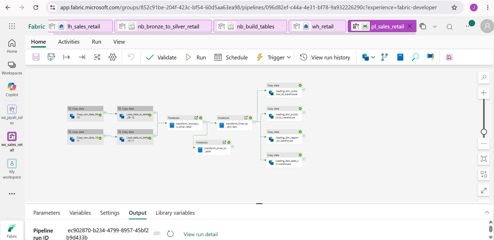
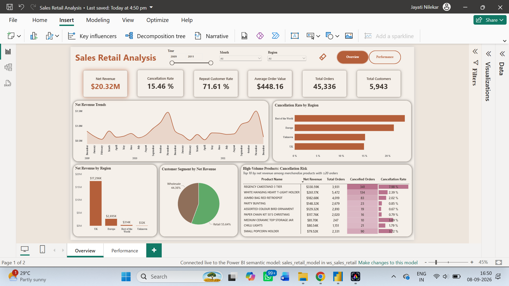
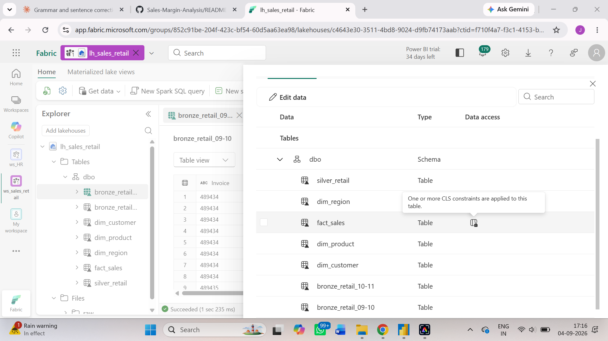
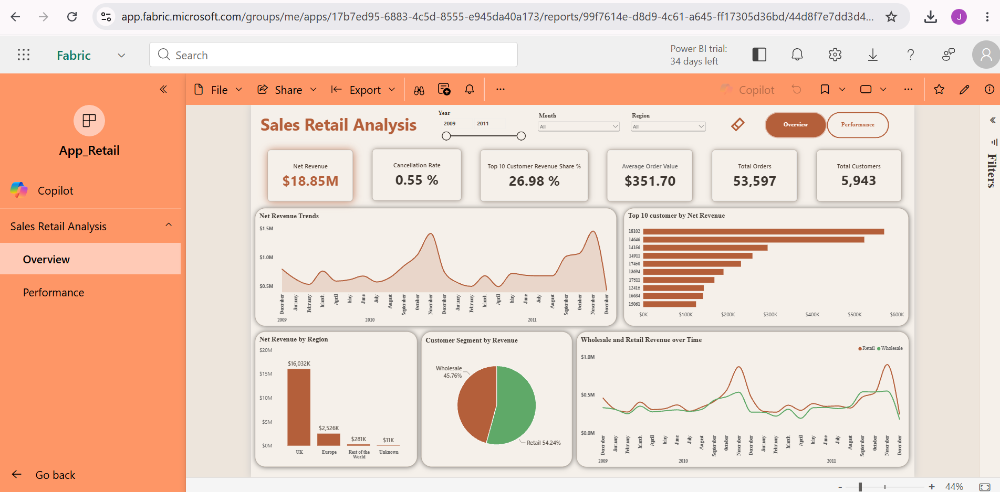

# Sales-Margin-Analysis

## 1. Project Title
**Finance Analysis**

Built an end-to-end sales retail analysis solution in Microsoft Fabric, ingesting ~1M+ records through a Fabric pipeline to understand Which customers, products, and regions are actually driving our revenue.

## 2. Short Description
The Sales Retail Analysis is an analytical report designed to help Priya (from Head of Sales Ops) understand Our sales team and leadership keep asking me the same question in every weekly review: 'Which customers, products, and regions are actually driving our revenue — and which ones are quietly dying?. This dashboard focuses on dashboard that shows revenue trends, customer segments (who's valuable, who's at risk), regional performance, and product performance, sliceable by date.. This tool is intended for use by data analysts, the sales department, management, and data-driven strategists who want to understand revenue trends.

## 3. Tech Stack
The dashboard was built using the following tools and technologies:

- **Microsoft Fabric Pipeline** – Ingested ~1M+ records through an online dataset and applied transformations using a notebook.
- **Microsoft PySpark Notebook** – Data transformation, cleaning, and feature engineering for preparing the data using PySpark.
- **Microsoft Lakehouse** – Primary data source with structured Delta tables in the Tables section.
- **Microsoft Fabric Semantic Model** – Created the data model and built relationships.
- **DAX (Data Analysis Expressions)** – Used for calculated measures, dynamic visuals, and conditional logic.
- **Power BI Desktop** – Main data visualization platform used for report creation.
- **OneLake Security** – Implemented column-level and row-level security to ensure the safety of personal data.
- **App** – Published `App_Retail` for end-user access.
- **File Format** – `.pbix` for development and `.png` for dashboard previews.

## 4. Data Source
- **Source:** UCI Machine Learning Repository Online Retail II
- **Link:** [[Sales Retail Dataset](https://archive.ics.uci.edu/dataset/502/online+retail+ii)

Data covers ~1M+ records, including details such as invoice date, invoice, description, customer id, stock code, price, country and quantity, for the years 2009–2011.

## 5. Workflow
The end-to-end pipeline was built entirely within Microsoft Fabric:

- **Workspace** – Created `ws_sales_retail` to host all Fabric items for this project.
- **Notebook** – Created a PySpark notebook and built the pipeline following medallion architecture: **Bronze** (raw invoice data ingested, checked types/nulls/row counts), **Silver** (cleaned, correctly typed, deduplicated), and **Gold** (aggregated and enriched with region, net revenue, and customer-level summaries for reporting).
- **Lakehouse** – Loaded all three layers into `lh_sales_retail` as structured Delta tables, with Bronze, Silver, and Gold sitting inside the same lakehouse.
- **Security** – Applied column-level security (hiding `price`) and row-level security (filtering by `region`) directly on `lh_sales_retail` using OneLake security, so protection is enforced consistently across every engine that queries it, not just the report.
- **Semantic Model** – Built `sales_retail_model`, which automatically inherits the OneLake security rules with no separate configuration needed.
- **Report** – Created the Sales Retail Analysis report in Power BI, with separate pages for Overview and Performance(repeat customer rate over time).
- **App** – Published `App_Retail` for end-user access.

## 6. Feature Highlights

### Business Problem
I used AI as a client, roleplaying as Priya from Head of Sales Ops, Our sales team and leadership keep asking me the same question in every weekly review: 'Which customers, products, and regions are actually driving our revenue — and which ones are quietly dying?

**Key Questions:**
Are we retaining customers, or is flat revenue masking churn that's being covered up by new customer acquisition?
Which countries/regions are growing vs. declining?
Are a small number of wholesale/bulk customers propping up the numbers while our regular customer base shrinks?
What's our repeat purchase rate, and which products drive repeat business vs. one-off purchases?
Are we over-relying on a handful of SKUs, and what happens to revenue if one of them has a supply issue?

### Goal of the Dashboard
The goal of this dashboard was to create an interactive report that helped the Sales department understand Which customers, products, and regions are actually driving our revenue — and which ones are quietly dying. This dashboard helped Priya from Sales communicate to leadership and senior management what steps could be taken to manage revenue and customer repeat rate and help business grow.

### Key Visuals

**KPIs used in this report:**
- **Net Revenue:** $18.85M — total revenue excluding cancellation
- **Average order value:** 351.71 
- **Total Customers:** 5943 — distinct count of customers
- **total orders:** 53,597 — total orders placed excluding cancelled one
- **Cancellation Rate:** 0.05% — how many orders were cancalled divided by total order including cancelled one
- top 10 customer revenue share %- 26.98% - top 10 customers are contributing to total revenue
- top 10 product revenue share %- 7.69% - top 10 products are contributing to total revenue
- repeat customer rate - 75.38% - customers ordering more than 1

**Slicers used:**
- Year (invoice year)
- Month (invoice month)
- Region

**Net Revenue Trends:**
A line chart where net revenue(revenue excluding cancelllation) is represented over time (month,year).

**wholesale and retail revenue over time:**
a line chart showing the revenue generated by wholesale and retail customers telling what is the trend over time.

**Net revenue by region:**
A bar chart showing the net revenue generated by each region.

**Top 10 Customers by net revenue:**
A bar chart of top 10 customers who generated highest revenue.

**monthly repeat customer rate:**
A line chart showing how the repeat customer rate is moving for each month.

## 7. Insights
- the net revenue generated is $18.85M but during 1st and 2nd quarter it is experiencing low spikes and in 4th quarter high spikes.
- top 10 customers are generating 26.98% of total revenue.
- The top 10 products are generating 7.69% of total revenue.
- customer repeat rate is 75.38%.
- wholesale revenue is not having much spikes and retail have more spikes thus retail contributes to more revenue split.
- guest customers are generating more revenue than repeat customers over time.
- the monthly repeat customer rate is moving around 30-40%.
- the revenue generated by registered customer is more than guest customer and thus having more avg order value.
- uk is generating the most revenue of $16,032k and least is by unknown which is $11k.

## 8. Business Impact
- give offers and discounts to improve revenue in 1 and 2 quarter of the year
- focus on more customer as now 26.98% is genreated by 10 customer it is highly dependent should divide equally to avoid dependancy.
- focus on more products as now 7.69% is genreated by 10 product it is highly dependent should divide equally to avoid dependancy.
- explore more markets in other region like europe and to generate revenue more there too and maintain in uk.
- reduce cancellation rate .
- increase revenue generated by repeat customer and convert more guest customer to repeat customer.
  
## 9. Screenshots
**Workspace (ws_finance)**

**Data ingesting through pipeline(pl_ingest_finance)**

**Data loading to Lakehouse (lh_finance)**

**Data in Lakehouse (lh_finance)**

**Semantic Model (Finance_Model)**

**Overview of Dashboard**

**Implementing Row Level Security**

**Row Level Security Applied**

**Column Level Security Applied**

**App (App_Finance)**

