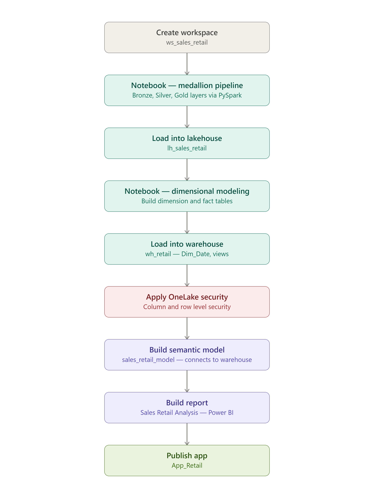
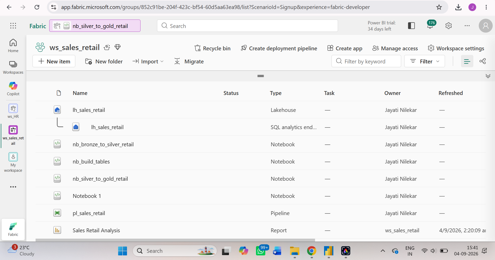
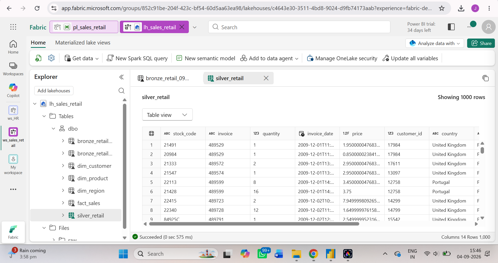
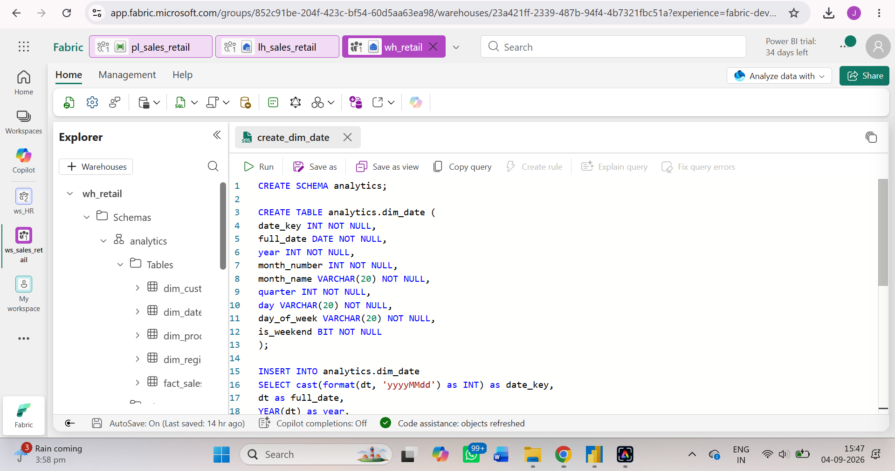
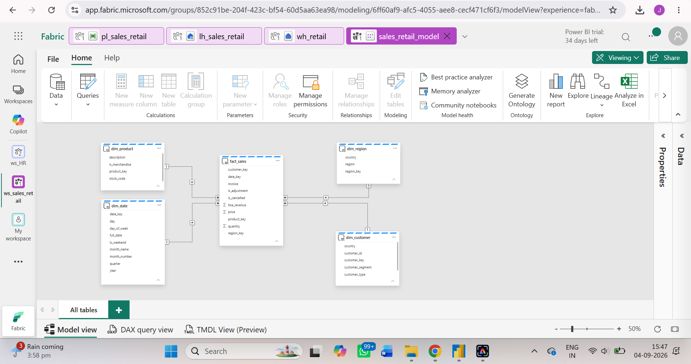
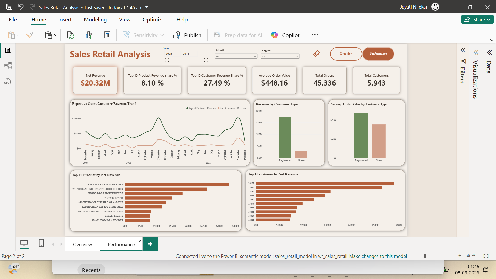
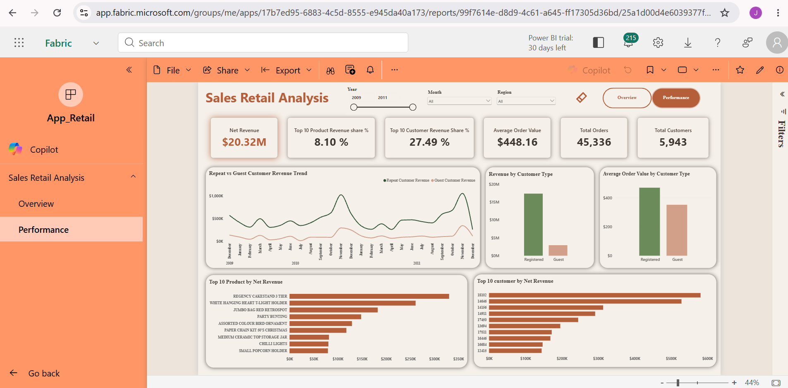

# Sales Retail Analysis

## 1. Project Title
**Sales Retail Analysis**

Built an end-to-end sales retail analysis solution in Microsoft Fabric, ingesting ~1M+ records through a Fabric pipeline to understand which customers, products, and regions are actually driving revenue.

## 2. Short Description
The Sales Retail Analysis is an analytical report designed to help Priya (Head of Sales Ops) answer a question that comes up in every weekly review: *"Which customers, products, and regions are actually driving our revenue — and which ones are quietly dying?"* This dashboard shows revenue trends, customer segments (who's valuable, who's at risk), regional performance, and product performance, all sliceable by date. This tool is intended for use by data analysts, the sales department, management, and data-driven strategists who want to understand revenue trends.

## 3. Tech Stack
The dashboard was built using the following tools and technologies:

- **Microsoft Fabric Pipeline** – Ingested ~1M+ records through an online dataset and applied transformations using a notebook.
- **Microsoft PySpark Notebook** – Data transformation, cleaning, feature engineering, and dimensional modeling (building dimension and fact tables) using PySpark.
- **Microsoft Lakehouse** – Primary data source with structured Delta tables in the Tables section.
- **Microsoft Fabric Warehouse** – Loaded dimension and fact tables, created a `Dim_Date` table, and analyzed the data using views before connecting it to the semantic model.
- **Microsoft Fabric Semantic Model** – Connected to the warehouse and built relationships, inheriting OneLake security automatically.
- **DAX (Data Analysis Expressions)** – Used for calculated measures, dynamic visuals, and conditional logic.
- **Power BI Desktop** – Main data visualization platform used for report creation.
- **OneLake Security** – Implemented column-level and row-level security to ensure the safety of sensitive data.
- **App** – Published `App_Retail` for end-user access.
- **File Format** – `.pbix` for development and `.png` for dashboard previews.

## 4. Data Source
- **Source:** UCI Machine Learning Repository — Online Retail II
- **Link:** [Sales Retail Dataset](https://archive.ics.uci.edu/dataset/502/online+retail+ii)

Data covers ~1M+ records, including details such as invoice date, invoice number, description, customer ID, stock code, price, country, and quantity, for the years 2009–2011.

## 5. Workflow
The end-to-end pipeline was built entirely within Microsoft Fabric:

- **Workspace** – Created `ws_sales_retail` to host all Fabric items for this project.
- **Notebook** – Created a PySpark notebook and built the pipeline following medallion architecture: **Bronze** (raw invoice data ingested, checked types/nulls/row counts), **Silver** (cleaned, correctly typed, deduplicated), and **Gold** (aggregated and enriched with region, net revenue, and customer-level summaries for reporting).
- **Lakehouse** – Loaded all three layers into `lh_sales_retail` as structured Delta tables, with Bronze, Silver, and Gold sitting inside the same lakehouse.
- **Notebook (Dimensional Modeling)** – Created a second notebook to build dimension and fact tables from the Gold layer, then loaded them into the Warehouse.
- **Warehouse** – Loaded the dimension and fact tables into `wh_retail`, created a `Dim_Date` table, and analyzed the data using views to validate the model before connecting it downstream.
- **Security** – Applied column-level security (hiding `price`) and row-level security (filtering by `region`) directly using OneLake security, so protection is enforced consistently across every engine that queries the data, not just the report.
- **Semantic Model** – Built `sales_retail_model`, connecting it to `wh_retail`, which automatically inherits the OneLake security rules with no separate configuration needed.
- **Report** – Created the Sales Retail Analysis report in Power BI, with separate pages for Overview and Sales Performance.
- **App** – Published `App_Retail` for end-user access.

## 6. Feature Highlights

### Business Problem
I used AI as a client, roleplaying as Priya, Head of Sales Ops. Her sales team and leadership kept asking the same question in every weekly review: *"Which customers, products, and regions are actually driving our revenue — and which ones are quietly dying?"*

**Key Questions:**
- Are we retaining customers, or is flat revenue masking churn that's being covered up by new customer acquisition?
- Which countries/regions are growing vs. declining?
- Are a small number of wholesale/bulk customers propping up the numbers while the regular customer base shrinks?
- What's our repeat purchase rate, and which products drive repeat business vs. one-off purchases?
- Are we over-relying on a handful of SKUs, and what happens to revenue if one of them has a supply issue?

### Goal of the Dashboard
The goal of this dashboard was to create an interactive report that helped the Sales department understand which customers, products, and regions were actually driving revenue — and which were quietly declining. This dashboard helped Priya communicate to leadership and senior management what steps could be taken to manage revenue and customer repeat rate, and support business growth.

### Key Visuals

**KPIs used in this report:**
- **Net Revenue:** $18.85M — total revenue excluding cancellations
- **Average Order Value:** $351.71
- **Total Customers:** 5,943 — distinct count of customers
- **Total Orders:** 53,597 — total orders placed, excluding cancelled ones
- **Cancellation Rate:** 0.05% — cancelled orders divided by total orders (including cancelled ones)
- **Top 10 Customer Revenue Share:** 26.98% — contribution of top 10 customers to total revenue
- **Top 10 Product Revenue Share:** 7.69% — contribution of top 10 products to total revenue
- **Repeat Customer Rate:** 75.38% — customers who ordered more than once

**Slicers used:**
- Year (invoice year)
- Month (invoice month)
- Region

**Net Revenue Trends:**
A line chart showing net revenue (excluding cancellations) over time (month, year).

**Wholesale and Retail Revenue Over Time:**
A line chart showing revenue generated by wholesale vs. retail customers and how the trend moves over time.

**Net Revenue by Region:**
A bar chart showing net revenue generated by each region.

**Top 10 Customers by Net Revenue:**
A bar chart of the top 10 customers who generated the highest revenue.

**Monthly Repeat Customer Rate:**
A line chart showing how the repeat customer rate moves month over month.

## 7. Insights
- Net revenue generated is $18.85M, with low spikes in Q1 and Q2 and high spikes in Q4.
- The top 10 customers generate 26.98% of total revenue.
- The top 10 products generate 7.69% of total revenue.
- Customer repeat rate stands at 75.38%.
- Wholesale revenue shows minimal spikes, while retail shows more — meaning retail contributes a larger share of revenue.
- Guest customers generate more revenue than repeat customers over time.
- The monthly repeat customer rate hovers around 30–40%.
- Revenue generated by registered customers exceeds that of guest customers, and registered customers also have a higher average order value.
- Guest customer are generating more revenue than repeat customers.
- The UK generates the most revenue at $16,032K, while "Unknown" generates the least at $11K.

## 8. Business Impact
- Offer discounts and promotions to boost revenue in Q1 and Q2.
- Reduce dependency on a small customer base — since 26.98% of revenue comes from just 10 customers, revenue should be diversified across a broader customer set.
- Reduce dependency on a small product base — since 7.69% of revenue comes from just 10 products, revenue should be diversified across a broader product range.
- Explore additional markets in other regions, such as Europe, to grow revenue there while maintaining strength in the UK.
- Reduce the cancellation rate.
- Increase revenue from repeat customers and convert more guest customers into repeat customers.
  
## 9. Screenshots
**Workspace (ws_sales_retail)**

**Data ingesting through pipeline(pl_sales_retail)**

**Data in Lakehouse (lh_sales_retail)**

**Data in Warehouse(wh_retail)**

**Semantic Model (sales_retail_model)**

**Overview of Dashboard**

**Performance of Dashboard**

**Implementing Row Level Security**

**Row Level Security Applied**

**Column Level Security Applied**

**App (App_Retail)**

